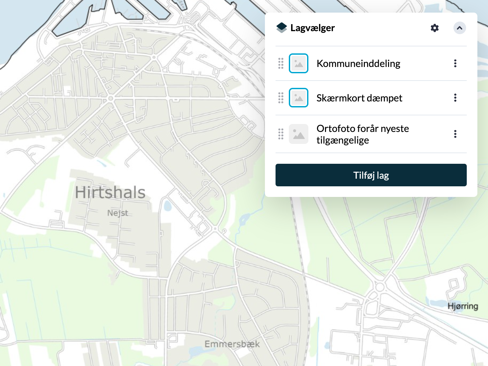
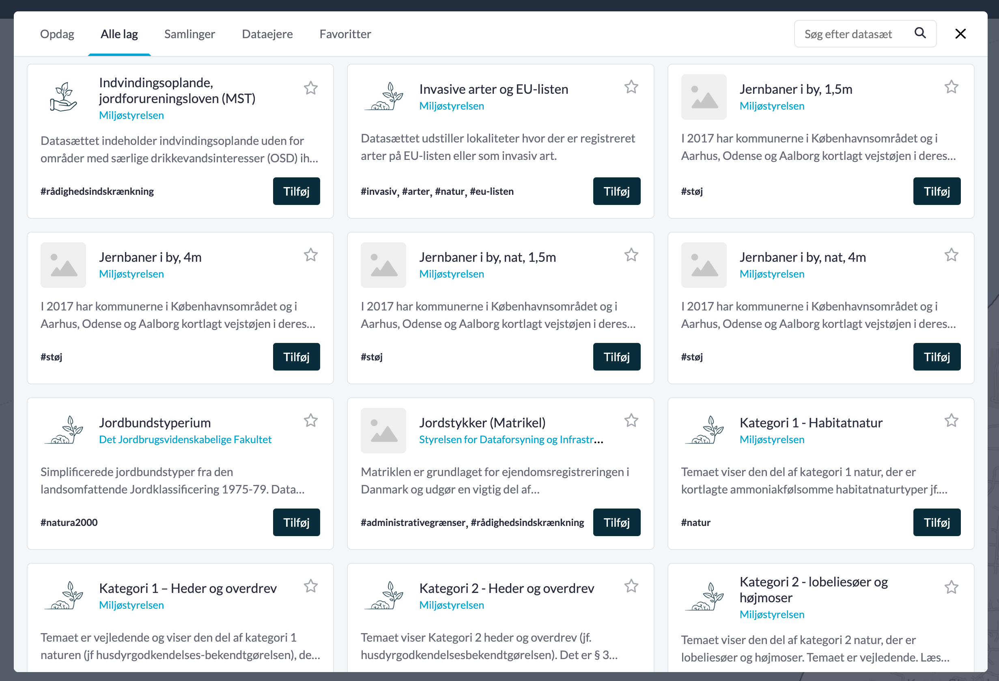
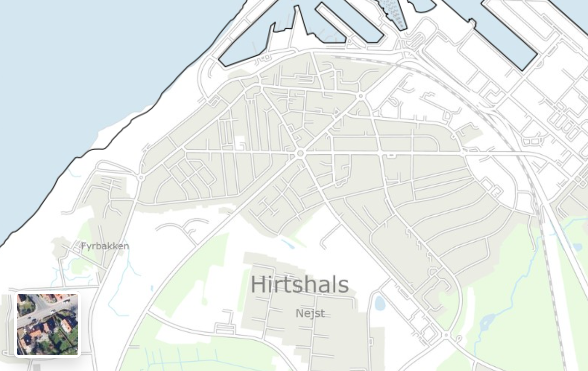
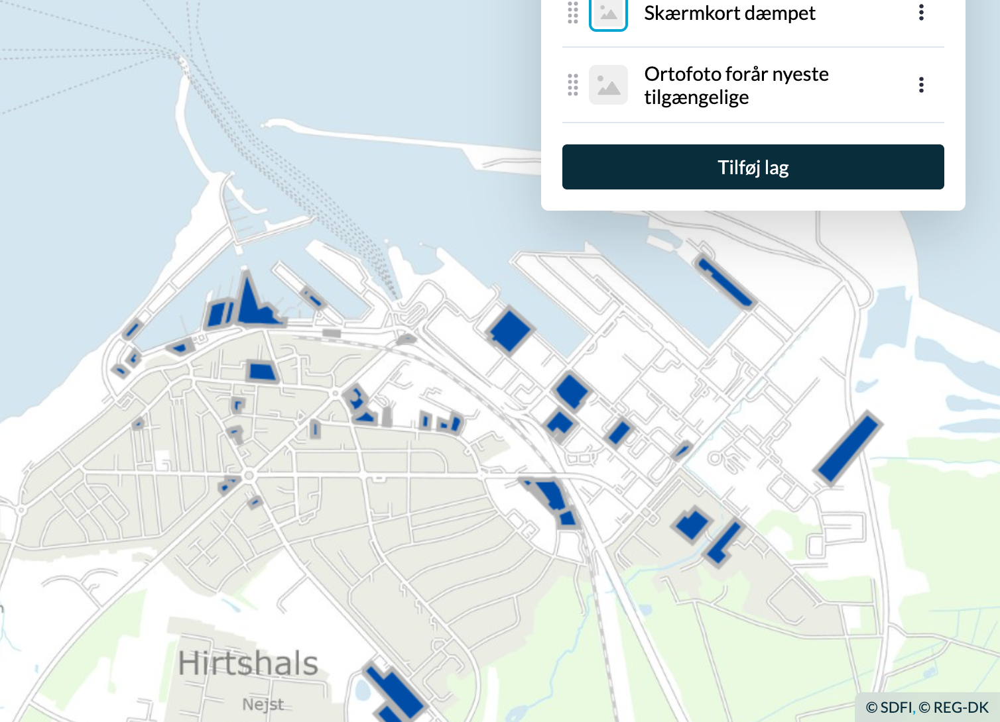

## Component usage

The DMP Map Components package contains multiple components, that can be used independently from each other as stand alone or in combination. 

The components are implemented in Vue 3 and is easiest to integrate in Vue 3 applications but has been tested to also works in other scenarios for example vanilla JavaScript, Ember JS and Angular.

See [API docs](https://npmdoc.miljoeportal.dk/map-components/) for general technical reference.

### LayerControl

The layer control component is a simple, user friendly UI that gives the user the ability to control the state og each dataset. The state contains information about witch datasets is available in the UI, if the datasets are visible or not and the order of the datasets.



The content of the [LayerControl](#layercontrol) can be modified by the application if needed. But it is possible to add datasets to the UI by using the [DatasetStore](#datasetstore) component.

Basic implementation:
```javascript
import { Api } from '@dmp/map-components'
import { LayerControl } from '@dmp/map-components'
import '@dmp/map-components/style.css'

const api = new Api({
  onlyRenderable: true,
})
api.load()
```

In the `template` add the component with a reference to the Client API, that the component should use:
```html
<LayerControl :api="api"/>
```

Thas is all you need.

#### Options

Beside adding the `api` to the component, there are multiple options to add:

##### collapsed

As default the [LayerControl](#layercontrol) is expanded. But by adding the `collapsed` option, it is possible to force the [LayerControl](#layercontrol) as collapsed instead:

```html
<LayerControl :api="api" :collapsed="true"/>
```

##### disableDatasetStore

To remove the "Add layers" button from the [LayerControl](#layercontrol), just add `disableDatasetStore` like this:

```html
<LayerControl :api="api" :disableDatasetStore="true"/>
```

This will remove the buttom as well as the "Show metadata" button and the "Remove layer" button from each dataset in the [LayerControl](#layercontrol).

##### currentResolution

If you are using the OpenLayers like descibed above, you can add a reactive property with the current resolution to the component. Then the component will indicate if the dataset is visible in the current zoom level:
```javascript
const currentResolution = ref<number>()
map.on('moveend', () => currentResolution.value = map.getView().getResolution())
```

```html
<LayerControl :api="api" :currentResolution="currentResolution"/>
```

##### hiddenDatasets

In some cases, like when using the [LayerToggle](#layertoggle) compoment, you would like to hide some specific datasets in the [LayerControl](#layercontrol) and in the [DatasetStore](#datasetstore). You can do this using the `hiddenDatasets` options like this:

```javascript
const layerToggleLayers = ['urn:dmp:ds:skaermkort-daempet', 'urn:dmp:ds:ortofoto-foraar-nyeste-tilgaengelige']
```

```html
<LayerControl :api="api" :hiddenDatasets="layerToggleLayers"/>
```

##### showQGISButton

On the ClientAPI, there is a helper function for downloading datasets as a QGIS project. It is possible to add a "Download QGIS project" button to the settings menu in the LayerControl. Just add `showQGISButton` as an option like this:

```html
<LayerControl :api="api" :showQGISButton="true"/>
```

When the user presses the button, the datasets that are visible in the LayerControl, will be included in the QGOS projekt.

### DatasetStore

The [DatasetStore](#datasetstore) component can be activated though the [LayerControl](#layercontrol) or as a stand alone. The [DatasetStore](#datasetstore) component is using the Client API to get access to the Datacatalog service. The [DatasetStore](#datasetstore) component makes it easy to find a dataset, see the relations between datasets and add datasets to the [LayerControl](#layercontrol). The [DatasetStore](#datasetstore) component shows all the details of a dataset including information about the related sources (like WMS and more) and the owner of a dataset.



Basic implementation (not needed if the [LayerControl](#layercontrol) is added!):
```javascript
import { Api } from '@dmp/map-components'
import { DatasetStore } from '@dmp/map-components'
import '@dmp/map-components/style.css'

const api = new Api()
api.load()
```

In the `template` add the component with a reference to the Client API, that the component should use:
```html
<DatasetStore :api="api"/>
```

#### Options

Beside adding the `api` to the component, there are multiple options to add:

##### hiddenDatasets

In some cases, like when using the [LayerToggle](#layertoggle) compoment, you would like to hide some specific datasets in the [LayerControl](#layercontrol) and in the [DatasetStore](#datasetstore). You can do this using the `hiddenDatasets` options like this:

```javascript
const layerToggleLayers = ['urn:dmp:ds:skaermkort-daempet', 'urn:dmp:ds:ortofoto-foraar-nyeste-tilgaengelige']
```

```html
<DatasetStore :api="api" :hiddenDatasets="layerToggleLayers"/>
```


### LayerToggle

The [LayerToggle](#layertoggle) component is a simple Google Maps-like baselayer control. It gives the user the ability to toggle between a list of baselayers provided by the application. The list of dataset contains two or more datasets.



Basic implementation:
```javascript
import { Api } from '@dmp/map-components'
import { LayerToggle } from '@dmp/map-components'
import '@dmp/map-components/style.css'

const layerToggleDatasets = ['urn:dmp:ds:skaermkort-daempet', 'urn:dmp:ds:ortofoto-foraar-nyeste-tilgaengelige']
const api = new Api({
  onlyRenderable: true,
  datasetState: layerToggleDatasets.map((id, index) => ({id,visible: index===0,opacity:1})),
})
api.load()
```

In the `template` add the component with a reference to the Client API and the list of ID's of datasets, that the component should use:
```html
<LayerToggle :api="api" :datasets="layerToggleDatasets"/>
```

The `datasetState` is set on the API to match the datasets in the [LayerToggle](#layertoggle). 

**Note:** If the active datasets doesn't match the list of datasets provides to the [LayerToggle](#layertoggle), the component is hidden. While testing, it can be a good idea to clear the local storage in the browser, or whipe it by calling the `load` method with a specific state, that matches the list of datasets provides to the [LayerToggle](#layertoggle).

### Attribution

The `Attribution` component will provide a list of attributions for the current active visible datasets. The list will update automatically when the active datasets changes. Duplicates are removed. 



Just like for the [LayerToggle](#layertoggle) component, you can create an `api` like this like described above (or reuse the one that is already created):
```javascript
import { Api } from '@dmp/map-components'
import { Attribution } from '@dmp/map-components'
import '@dmp/map-components/style.css'

const api = new Api()
api.load()
```

In the `template` add the component with a reference to the Client API:
```html
<Attribution :api="api"/>
```

## FAQ

- To change the active datasets, just modify the `api.activeDatasets` property. The `layerGroup` in OpenLayers will reflect the state and the order of the `api.activeDatasets` collection.

- Don't modify the `layerGroup` from the Client API programmatically.

- OpenLayers 7+ is required.

- If you are using Typescript, then you need to use the same Major and Minor version as the TypeScript used in the Client API package.
